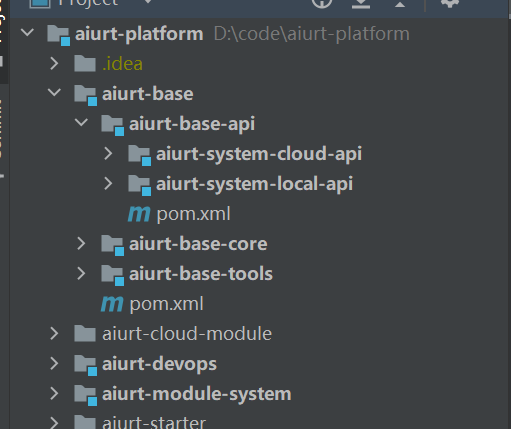
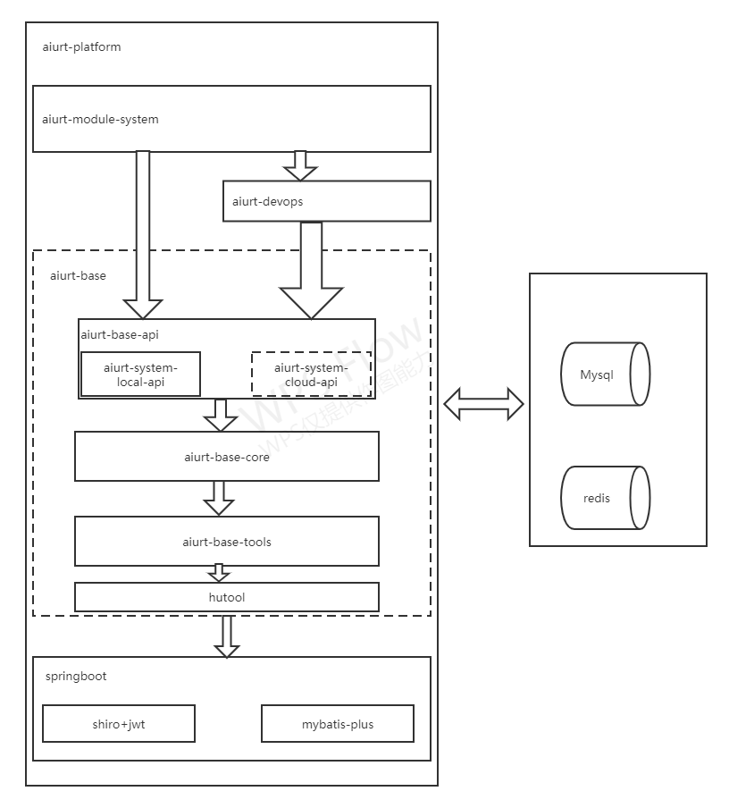
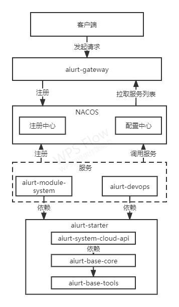
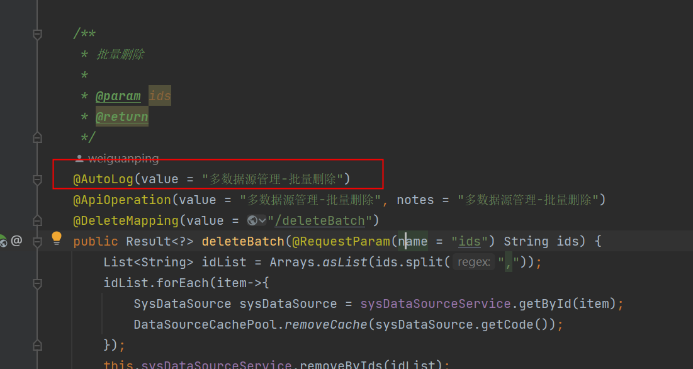

# 运维平台

运维平台是基于jeecg平台改造的一款基于代码生成器的低代码平台。前后端分离架构 SpringBoot2.x，SpringCloud，Ant Design&Vue，
Mybatis-plus，Shiro，JWT，websocket支持微服务。
后端技术：Spring Boot 2.6.6 + SpringcloudAlibaba2021.1 +MybatisPlus 3.5.1 + Shiro 1.8.0+ Jwt 3.11.0 + Swagger + Redis

## 项目结构

├─aiurt-platform（父POM： 项目依赖、modules组织)  <br>
│  ├─aiurt-base（共通模块： 工具类、config、权限、查询过滤器、注解、接口等） <br>
│  │  ├─aiurt-base-api（接口，主要实现跨模块实现调用，以及微服务间的调用<br>
│  │  ├─aiurt-base-core（共通模块： 工具类、config、权限shiro、查询过滤器、注解、接口，统一的返回结构，统一的异常处理等） <br>
│  │  ├─aiurt-base-tools（共通模块： 通用常量，枚举类，redis配置，以及RedisListener自定义消息监听等） <br>
│  ├─aiurt-module-system （系统管理权限、用户、机构、线路、站点等基础数据功能） -- 默认作为启动项目  <br>
│  ├─aiurt-devops 运维平台的业务代码，以后可抽取成单独的微服务  <br>
│  ├─aiurt-starter（微服务starter模块，不需要微服务可以删掉）  <br>
│  ├─aiurt-cloud-module（微服务生态模块，不需要微服务可以删掉）  <br>




## 项目依赖关系
### 单体


### 微服务



## 后端开发常用技能

### Maven私服设置
```xml
<mirrors>
       <mirror>
            <id>nexus-aliyun</id>
            <mirrorOf>*,!jeecg,!jeecg-snapshots,!getui-nexus</mirrorOf>
            <name>Nexus aliyun</name>
            <url>http://maven.aliyun.com/nexus/content/groups/public</url>
        </mirror> 
</mirrors>
```
此配置重点在这句话<mirrorOf>*,!jeecg,!jeecg-snapshots</mirrorOf>
如果不加这句话，默认所有的依赖都会去阿里云仓库下载，加上后jeecg的依赖包就可以从jeecg私服下载了。

### 字典翻译注解@Dict
将数据库某一列的值按照字典配置翻译成对应的文字描述，本方法针对返回对象为Result 的IPage的分页列表数据进行动态字典注入
注入实现 通过对实体类添加注解@dict 来标识需要的字典内容,字典分为单字典code即可 ，table字典 code table text配合使用
示例为SysUser   字段为sex 添加了注解@Dict(dicCode = "sex") 会在字典服务立马查出来对应的text 然后在请求list的时候将这个字典text，已字段名称加_dictText形式返回到前端

1.后端实体属性上加注解(此处dicCode 对应上述字典编码)
```
/**
  * 性别（1：男 2：女）
  */
 @Dict(dicCode = "sex")
  private Integer sex;
```
返回实例

```
    例输入当前返回值的就会多出一个sex_dictText字段
      {
           sex:1,
           sex_dictText:"男"
     }
```

2.前端定义column(此处dataIndex原字段名为sex ,这里需要定义为sex_dictText,即原字段名+'__dictText')

```
columns: [
    //...省略其他列
    {
     title: '性别',
     align: "center",
     width: 80,
     dataIndex: 'sex_dictText'
     }]
```

### 日志记录注解@AutoLog



### 数据权限注解@PermissionData
[注解](http://doc.jeecg.com/2044045)

### 事务 @Transactional
```
采用注解事务方式，事务控制在service层面。
注解： @Transactional
```
如何加事务？=> 在service对应的方法加上注解@Transactional即可，具体参考一下代码：
```
 /**
	 * 事务控制在service层面
	 * 加上注解：@Transactional，声明的方法就是一个独立的事务（有异常DB操作全部回滚）
	 */
	@Transactional
	public void testTran() {
		Demo pp = new Demo();
		pp.setAge(1111);
		pp.setName("测试事务  小白兔 1");
		DemoMapper.insert(pp);
		
		Demo pp2 = new Demo();
		pp2.setAge(2222);
		pp2.setName("测试事务  小白兔 2");
		DemoMapper.insert(pp2);
		
		Integer.parseInt("hello");//自定义异常
		
		Demo pp3 = new Demo();
		pp3.setAge(3333);
		pp3.setName("测试事务  小白兔 3");
		DemoMapper.insert(pp3);
		return ;
	}
```

### 自定义sql分页实现

1： mapper 接口以及 xml
```java
/**
 * @Description: 系统通告表
 * @Author: jeecg-boot
 * @Date:  2019-01-02
 * @Version: V1.0
 */
public interface SysAnnouncementMapper extends BaseMapper<SysAnnouncement> {

	
	List<SysAnnouncement> querySysCementListByUserId(Page<SysAnnouncement> page, String userId,String msgCategory);

}
```
这里要注意的是，这个 Page page 是必须要有的，否则 Mybatis-Plus 无法为你实现分页。

```xml
<resultMap id="SysAnnouncement" type="org.jeecg.modules.system.entity.SysAnnouncement" >
		<result column="id" property="id" jdbcType="VARCHAR"/>
		<result column="titile" property="titile" jdbcType="VARCHAR"/>
		<result column="msg_content" property="msgContent" jdbcType="VARCHAR"/>
		<result column="start_time" property="startTime" jdbcType="TIMESTAMP"/>
		<result column="end_time" property="endTime" jdbcType="TIMESTAMP"/>
		<result column="sender" property="sender" jdbcType="VARCHAR"/>
		<result column="priority" property="priority" jdbcType="VARCHAR"/>
		<result column="msg_category" property="msgCategory" jdbcType="VARCHAR"/>
		<result column="msg_type" property="msgType" jdbcType="VARCHAR"/>
		<result column="send_status" property="sendStatus" jdbcType="VARCHAR"/>
		<result column="send_time" property="sendTime" jdbcType="VARCHAR"/>
		<result column="cancel_time" property="cancelTime" jdbcType="VARCHAR"/>
		<result column="del_flag" property="delFlag" jdbcType="VARCHAR"/>
		<result column="create_by" property="createBy" jdbcType="VARCHAR"/>
		<result column="create_time" property="createTime" jdbcType="TIMESTAMP"/>
		<result column="update_by" property="updateBy" jdbcType="VARCHAR"/>
		<result column="update_time" property="updateTime" jdbcType="TIMESTAMP"/>
		<result column="user_ids" property="userIds" jdbcType="VARCHAR"/>
	</resultMap>
	
	
	<select id="querySysCementListByUserId" parameterType="String"  resultMap="SysAnnouncement">
	   select sa.* from sys_announcement sa,sys_announcement_send sas 
	   where sa.id = sas.annt_id 
	   and sa.send_status = '1'
	   and sa.del_flag = '0'
	   and sas.user_id = #{userId}
	   and sa.msg_category = #{msgCategory}
	   and sas.read_flag = '0'
	</select>
```
2:   service 实现
```java
    @Override
	public Page<SysAnnouncement> querySysCementPageByUserId(Page<SysAnnouncement> page, String userId,String msgCategory) {
		 return page.setRecords(sysAnnouncementMapper.querySysCementListByUserId(page, userId, msgCategory));
	}
```
3:  controller 实现
```java
@RequestMapping(value = "/list", method = RequestMethod.GET)
	public Result<Page<SysAnnouncement>> queryPageList(SysAnnouncement sysAnnouncement,
									  @RequestParam(name="pageNo", defaultValue="1") Integer pageNo,
									  @RequestParam(name="pageSize", defaultValue="10") Integer pageSize,
									  HttpServletRequest req) {
		Result<Page<SysAnnouncement>> result = new Result<Page<SysAnnouncement>>();
		Page<SysAnnouncement> pageList = new Page<SysAnnouncement>(pageNo,pageSize);
		pageList = sysAnnouncementService.querySysCementPageByUserId(pageList,"","1");//通知公告消息
		log.info("查询当前页："+pageList.getCurrent());
		log.info("查询当前页数量："+pageList.getSize());
		log.info("查询结果数量："+pageList.getRecords().size());
		log.info("数据总数："+pageList.getTotal());
		result.setSuccess(true);
		result.setResult(pageList);
		return result;
	}
```
### 平台消息推送接口

[消息](http://doc.jeecg.com/2043949)

### 文件上传接口(图片/文件)
[文件上传接口说明](http://doc.jeecg.com/2043969)
目前的方案是本地
自行配置文件上传路径：还需要配置jeecg.path.upload

文件上传访问路径:
```
http://127.0.0.1:8080/sys/common/upload
```
文件下载:

### swagger文档地址吧
通过 http://localhost:8080/doc.html 访问后台项目的swagger地址。

### 项目打包

mvn clean package -P test
